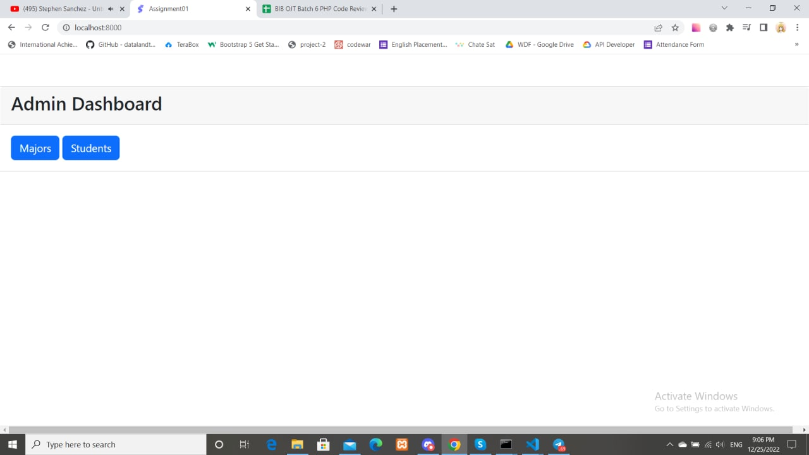
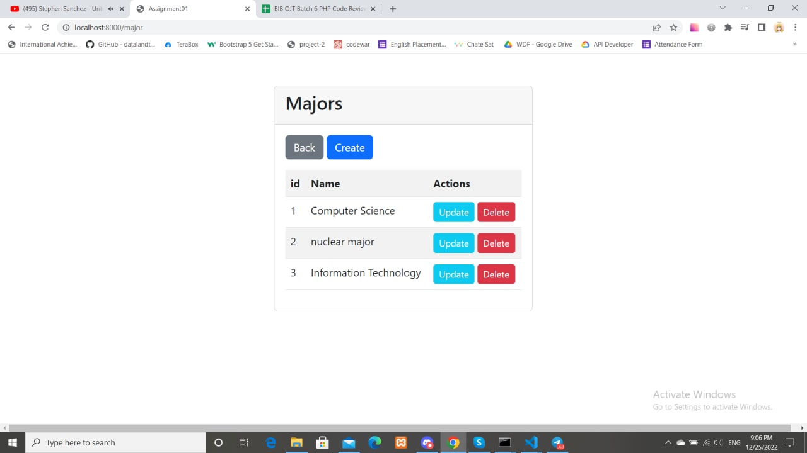
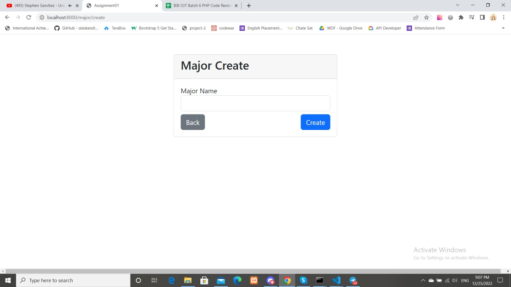
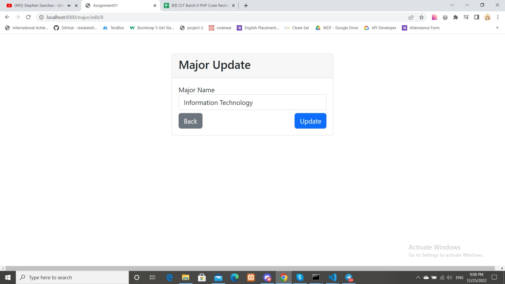
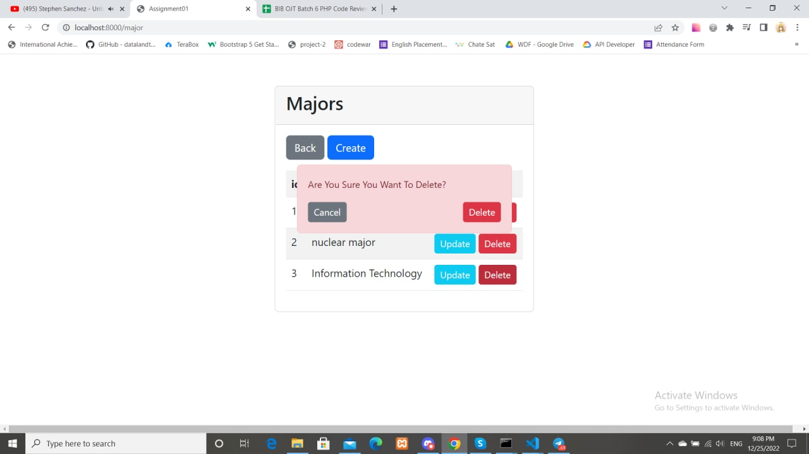
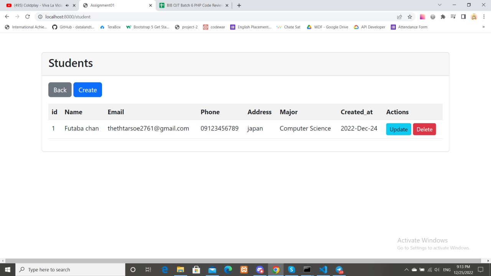
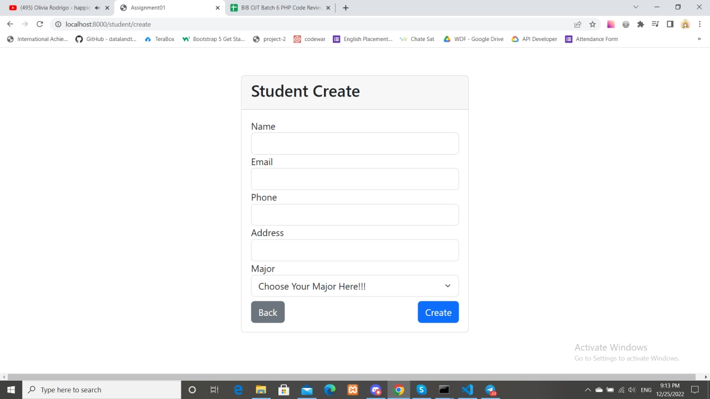
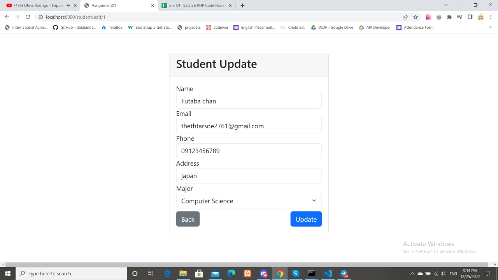
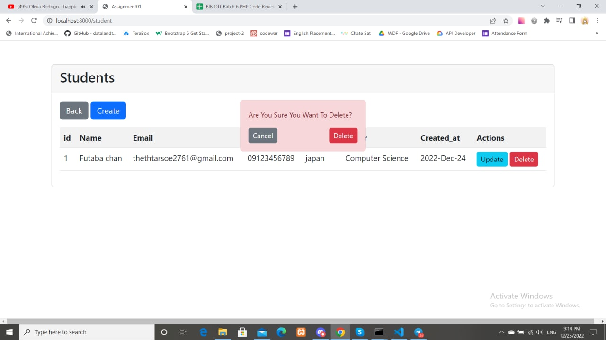

<h1>Preview Assignment_01</h1>
<h2>Step1:Change Database Name,Username,Password</h2>
<h2>Step2:Create Majors First</h2>

<h4>Dashboard</h4>

<h4>Majors</h4>

<h4>Majors Create</h4>

<h4>Majors Update</h4>

<h4>Majors Delete</h4>

<h4>Students</h4>

<h4>Students Create</h4>

<h4>Students Update</h4>

<h4>Students Delete</h4>