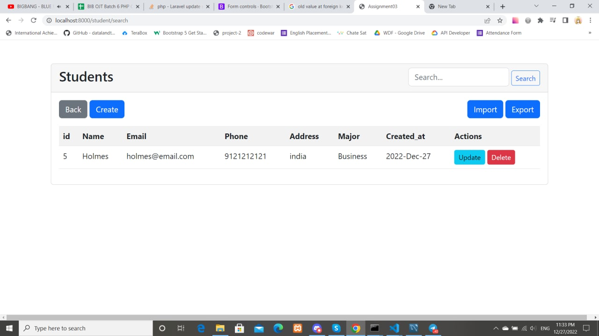
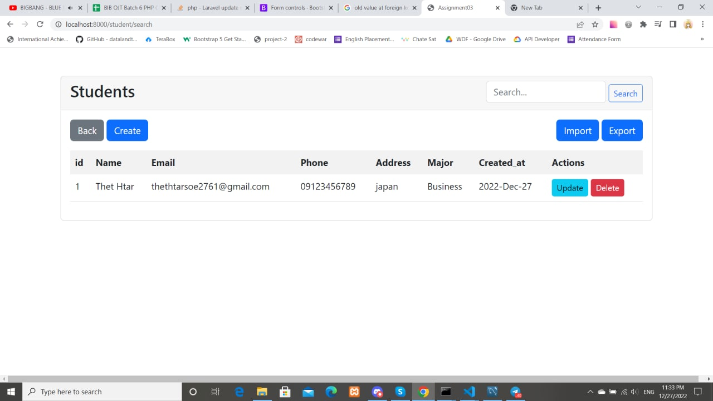
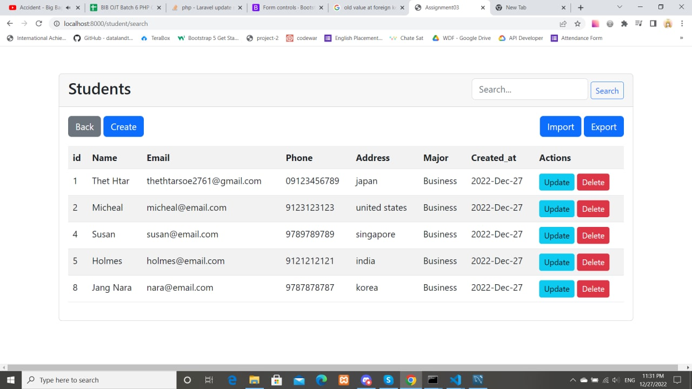

<h1>Preview Assignment_02</h1>
<h2>Step1:Change Database Name,Username,Password</h2>
<h2>Step2:Create Majors First</h2>

<h4>Search Students Using Name</h4>

<h4>Search Students Using Email</h4>

<h4>Search Students Using Majors</h4>
<h4>Note:There is a sample csv file for testing in file folder</h4>
