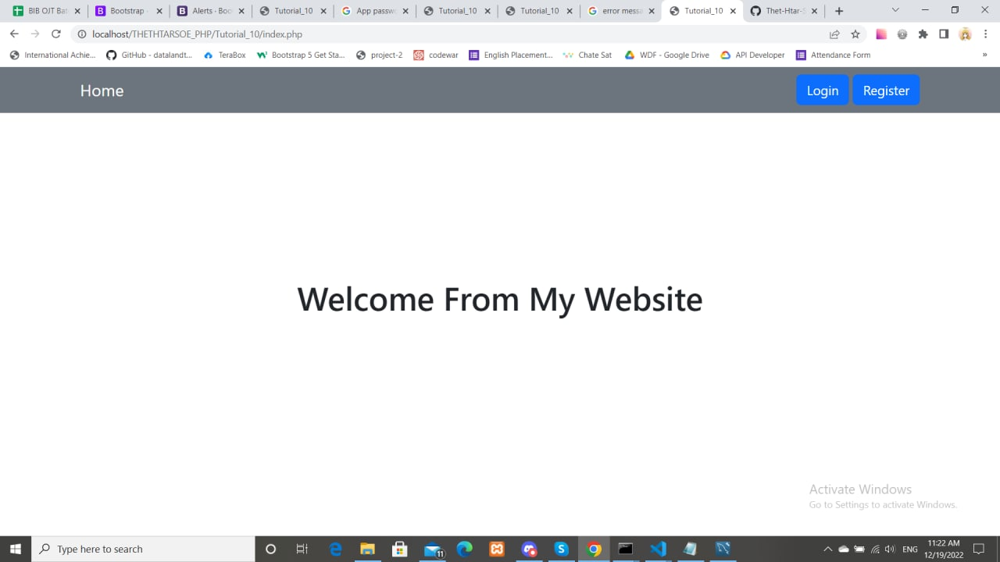
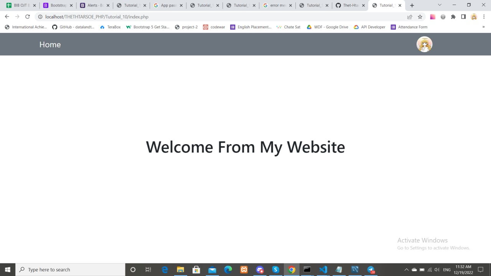
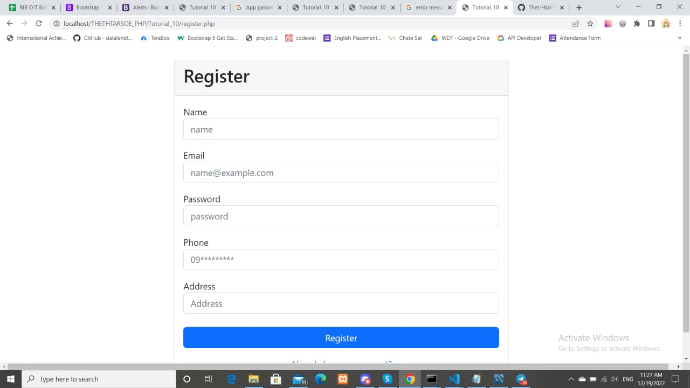
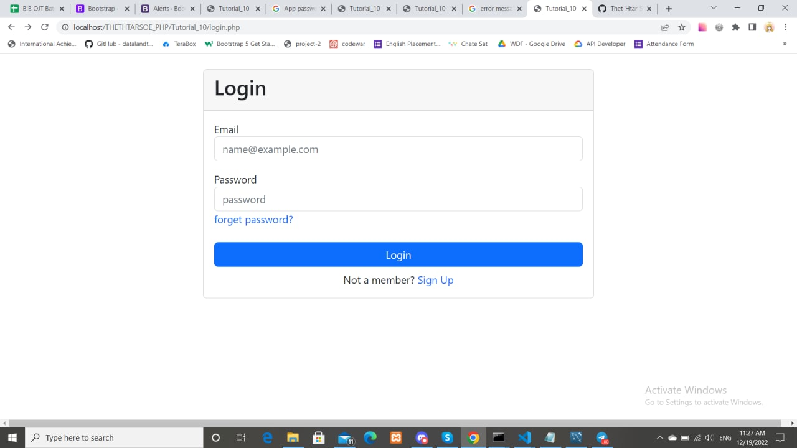
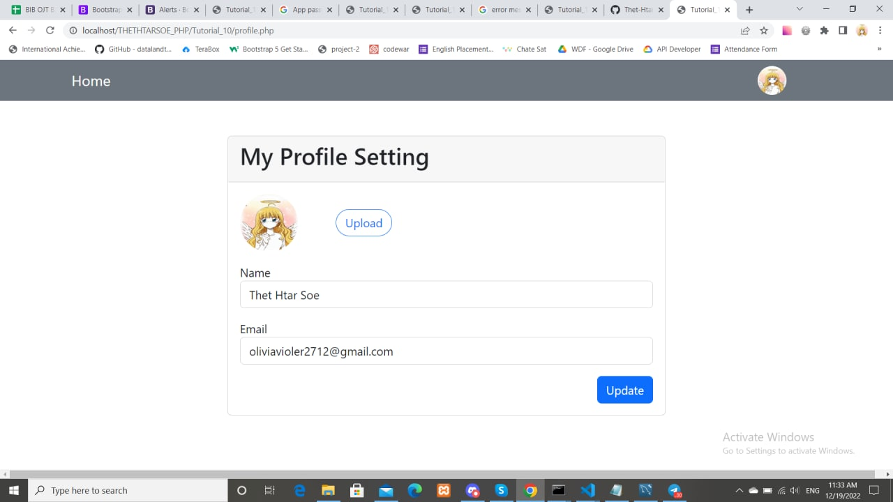
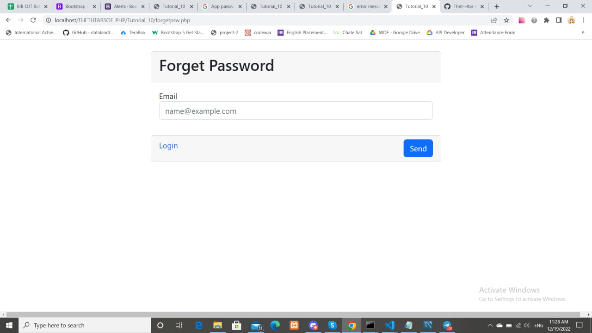
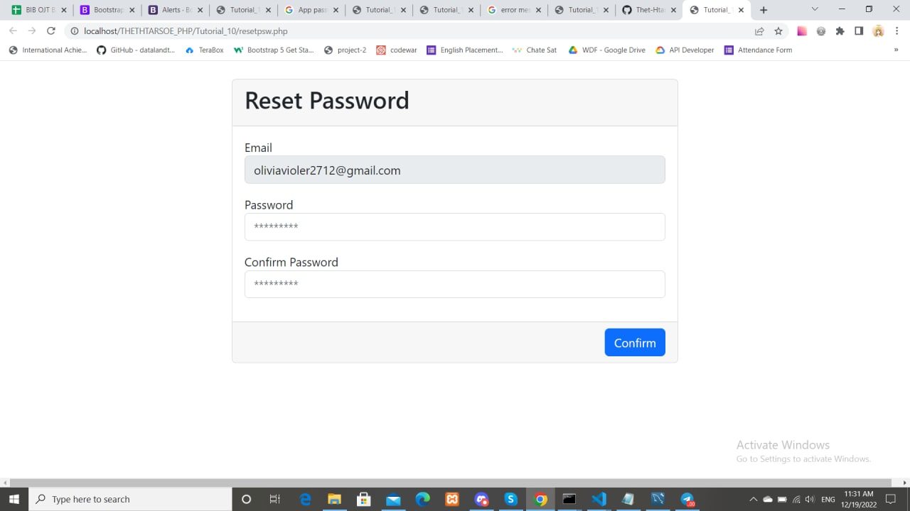

<h2>Preview</h2>
<h2>Step1-database.php</h2>
<h2>Step2-forgetpsw.php                
$mail->Username   = 'example@gmail.com';
$mail->Password   = gmail app psw; 
$mail->Body = have to add resetpsw.php link; 
</h2>
<h3>Home Design With No Auth</h3>

<h3>Home Design With Auth</h3>

<h3>Register Form</h3>

<h3>Login Form</h3>

<h3>Profile Form</h3>

<h3>Forget Password Form</h3>

<h3>Reset Password Form</h3>
